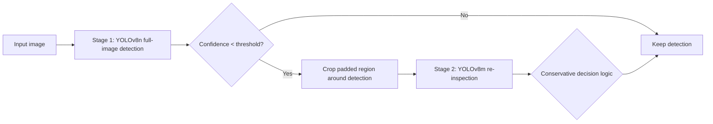
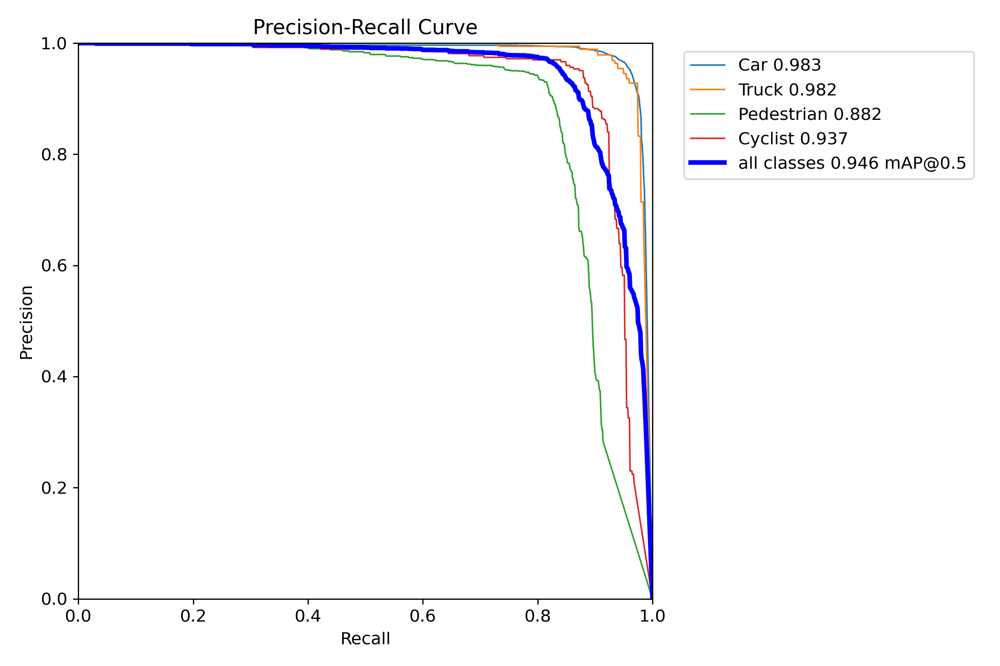
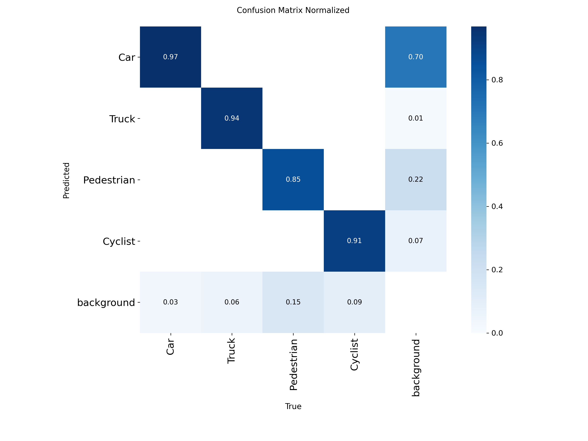
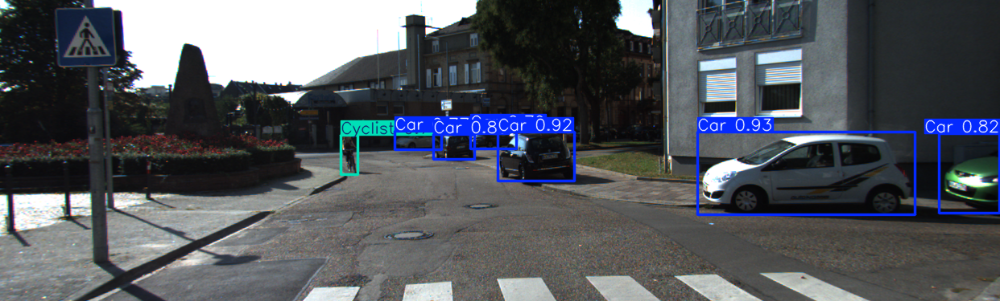

# Hybrid Object Detection for Autonomous Driving

[](https://github.com/Egzavyer/QuickCV/actions/workflows/ci.yml)

A two-stage, confidence-gated object detection pipeline optimized for **real-time CPU inference**. A fast detector runs on every frame; only *uncertain* detections are escalated to a stronger, more expensive model. This recovers accuracy on hard objects while avoiding the cost of running the heavy model on everything.

Trained and evaluated on the **KITTI 2D Object Detection** benchmark (4 classes: Car, Truck, Pedestrian, Cyclist).

**Stack:** Python · PyTorch · Ultralytics YOLOv8 · OpenVINO (INT8 quantization) · ONNX · OpenCV · NumPy

---

## Highlights

- **0.946 mAP@0.5** on the KITTI validation split (per-class AP up to 0.98 on vehicles).
- **~1.9× faster end-to-end** after OpenVINO INT8 quantization (22.1 s → 11.6 s over 100 images on CPU).
- **Selective escalation:** the heavy second-stage model runs on only **~31%** of detections, not all of them.
- **+0.27 mean confidence gain** on escalated detections (0.47 → 0.76) via second-stage re-inspection.
- **Conservative, class-aware relabeling** prevents the stronger model from corrupting already-correct predictions.

---

## How It Works



1. **Stage 1** runs a fast YOLOv8n detector over the full frame.
2. **Escalation** selects detections whose confidence falls below a threshold.
3. **Stage 2** crops a padded region around each uncertain detection and re-runs a stronger YOLOv8m model.
4. **Decision logic** applies confidence/delta gates and special handling for visually similar classes (Cyclist ↔ Pedestrian), so labels only change when the second stage is decisively more confident.
5. **Outputs** include per-stage timing, confidence deltas, escalation statistics, and optional annotated images.

---

## Results

### Detection accuracy (KITTI validation split)

| Class      | AP@0.5 | Recall |
| ---------- | ------ | ------ |
| Car        | 0.983  | 0.97   |
| Truck      | 0.982  | 0.94   |
| Cyclist    | 0.937  | 0.91   |
| Pedestrian | 0.882  | 0.85   |
| **All**    | **0.946 mAP@0.5** | — |

<p align="center">
  
  
</p>

### Inference efficiency (100 validation images, CPU)

| Deployment format | Stage-1 latency | Stage-2 latency | End-to-end | Escalation rate | Avg Δconf |
| ----------------- | --------------- | --------------- | ---------- | --------------- | --------- |
| OpenVINO (FP)     | 76.9 ms/img     | 98.4 ms/crop    | 22,084 ms  | 31.3%           | +0.27     |
| **OpenVINO INT8** | **51.0 ms/img** | **42.3 ms/crop**| **11,592 ms** | 32.1%        | +0.27     |
| **Improvement**   | **−34%**        | **−57%**        | **−47%**   | —               | no loss   |

INT8 quantization roughly halves end-to-end latency with no measurable drop in the confidence gains delivered by the second stage.

### Sample output

<p align="center">
  
</p>

---

## Repository Structure

```text
.
├── main.py                     # Hybrid two-stage inference pipeline
├── models/                     # Detection package
│   ├── model.py                # YOLO wrapper: prediction, filtering, escalation, crops
│   ├── decision.py             # Pure stage-1/stage-2 relabeling logic (dependency-free)
│   └── geometry.py             # Shared 2D geometry helpers (box area, padding)
├── src/
│   ├── train.py                # Training script
│   ├── validate_models.py      # Validation (precision/recall/mAP, per-class, speed)
│   ├── export.py               # ONNX / OpenVINO / OpenVINO INT8 export
│   ├── benchmark.py            # Warm-up + benchmark harness with summary tables
│   └── download_dataset.py     # Fetch the KITTI dataset from Kaggle into ./yolo
├── tests/                      # Unit tests for decision + geometry logic
├── samples/images/             # Demo images so the pipeline runs without the dataset
├── benchmark_runs/             # Saved benchmark logs and summary table
├── runs/                       # Validation curves and annotated sample outputs
├── yolo/
│   └── data.yaml               # Dataset config (4 classes)
├── pyproject.toml              # Ruff / mypy / pytest configuration
├── requirements.txt
└── *_openvino_model/           # Exported detectors (tracked via Git LFS)
```

---

## Setup

### 1. Clone (with Git LFS)

Model weights are stored with [Git LFS](https://git-lfs.com). Install it once, then clone:

```bash
git lfs install
git clone https://github.com/Egzavyer/QuickCV.git
cd QuickCV
```

### 2. Create an environment and install dependencies

```bash
python -m venv .venv
source .venv/bin/activate        # Windows: .venv\Scripts\activate
pip install -r requirements.txt
```

### 3. Download the dataset (optional — only needed to train/validate)

The dataset (~6 GB) is hosted on Kaggle at [xavierlermusieaux/kitti-yolo](https://www.kaggle.com/datasets/xavierlermusieaux/kitti-yolo) and is **not** stored in the repository. Fetch it with:

```bash
python src/download_dataset.py
```

This downloads and arranges the data into the `yolo/{images,labels}/{train,val}` layout expected by `yolo/data.yaml`.

---

## Usage

### Run the hybrid pipeline (recommended INT8 config)

A handful of demo images ship in `samples/images/`, so the pipeline runs immediately
after install — no dataset download required:

```bash
python main.py \
  --fast-model yolov8n_int8_640_openvino_model/ \
  --slow-model yolov8m_int8_320_openvino_model/ \
  --image-dir samples/images \
  --images 000021 000048 000058 000076 000100 000103 \
  --threshold 0.7 \
  --stage1-imgsz 640 \
  --stage2-imgsz 320 \
  --save-vis
```

Annotated images are written to `runs/hybrid_vis/`. Add `--show` to open them in GUI
windows. To run on the full validation split, download the dataset (below) and point
`--image-dir` at `yolo/images/val`.

### Train

```bash
python src/train.py
```

### Validate

```bash
python src/validate_models.py --models yolov8n.pt yolov8m.pt --data yolo/data.yaml --device cpu
```

Reports precision, recall, mAP@0.5, mAP@0.5:0.95, per-class mAP, and validation speed.

### Export to deployment formats

```bash
python src/export.py \
  --models yolov8n.pt yolov8m.pt \
  --onnx --openvino --openvino-int8 \
  --data yolo/data.yaml --imgsz 640
```

### Benchmark (FP vs INT8)

```bash
python src/benchmark.py \
  --image-dir yolo/images/val --count 100 \
  --fast-model yolov8n_640_openvino_model/ \
  --slow-model yolov8m_320_openvino_model/ \
  --fast-model-int8 yolov8n_int8_640_openvino_model/ \
  --slow-model-int8 yolov8m_int8_320_openvino_model/ \
  --out-dir benchmark_runs
```

Produces per-run logs and `benchmark_runs/summary_table.md`.

### Key pipeline arguments

| Argument | Description |
| -------- | ----------- |
| `--fast-model` / `--slow-model` | Stage-1 and stage-2 model paths |
| `--threshold` | Detections below this confidence are escalated |
| `--stage1-imgsz` / `--stage2-imgsz` | Inference image size per stage |
| `--min-pad` / `--pad-ratio` | Crop padding (fixed pixels / fraction of box size) |
| `--similar-min-conf` / `--similar-min-delta` | Relabel gates for similar classes |
| `--general-min-conf` / `--general-min-delta` | Relabel gates for other classes |
| `--save-vis` / `--show` | Save / display annotated outputs |

---

## Development

The conservative relabeling rules and geometry helpers are isolated in
dependency-free modules (`models/decision.py`, `models/geometry.py`) so they can be
linted, type-checked, and unit-tested without loading the inference stack. CI runs
on every push:

```bash
pip install ruff mypy pytest
ruff check .
mypy models/decision.py models/geometry.py
pytest
```

## Deployment Notes

- **OpenVINO INT8** is the recommended CPU deployment format and powers the headline latency numbers.
- Stage 1 and stage 2 are exported at different input sizes (640 and 320) to balance recall and speed.
- The pipeline is UI-agnostic and exposes structured metrics, making it straightforward to wrap in a service or visualization layer.

## Limitations

- Evaluated on CPU; GPU or other accelerators will produce different latency profiles.
- The label space covers 4 KITTI classes.
- The confidence-gain metric reflects second-stage certainty on escalated crops, not a re-validated mAP improvement.
